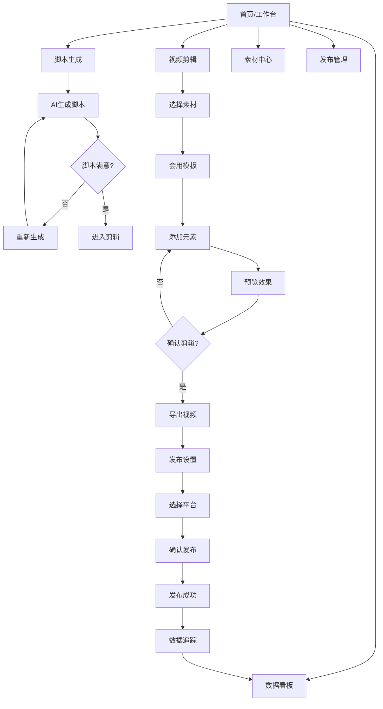
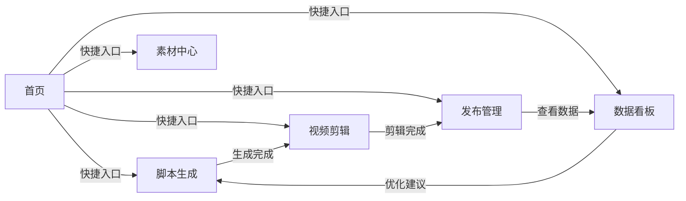

# 短视频工厂系统 - 移动端原型设计

> 设计角色：绘颜（前端UI专家）  
> 版本：v1.0  
> 日期：2026-04-02

---

## 一、色彩体系

### 1.1 主色彩

| 用途 | 色值 | 说明 |
|------|------|------|
| 主色 Primary | `#6C5CE7` | 品牌主色，用于主要按钮、标题高亮、Tab选中态 |
| 主色浅 | `#A29BFE` | 背景装饰、渐变过渡 |
| 主色深 | `#5541D7` | 按钮按压态 |

### 1.2 功能色彩

| 用途 | 色值 | 说明 |
|------|------|------|
| 成功 Success | `#00B894` | 成功状态、已完成标识 |
| 警告 Warning | `#FDCB6E` | 等待处理、审核中 |
| 错误 Error | `#E17055` | 失败状态、错误提示 |
| 提示 Info | `#74B9FF` | 信息提示、链接色 |

### 1.3 中性色彩

| 用途 | 色值 | 说明 |
|------|------|------|
| 标题文字 | `#2D3436` | 一级标题、重要文字 |
| 正文文字 | `#636E72` | 二级文字、说明文字 |
| 次要文字 | `#B2BEC3` | 辅助说明、时间戳等 |
| 分割线 | `#DFE6E9` | 列表分割、卡片边框 |
| 背景色 | `#F8F9FA` | 页面背景 |
| 卡片背景 | `#FFFFFF` | 卡片、浮层背景 |
| 深色背景 | `#1A1A2E` | 视频预览、全屏模式 |

---

## 二、字体规范

```
字体族：-apple-system, "PingFang SC", "Microsoft YaHei", sans-serif

字号层级：
├── 大标题 H1    20px / 700  行高 1.4
├── 标题 H2      18px / 600  行高 1.4
├── 副标题 H3    16px / 600  行高 1.4
├── 正文 Body    14px / 400  行高 1.5
├── 辅助文字     12px / 400  行高 1.5
└── 最小字号     10px / 400  行高 1.5
```

---

## 三、间距系统

基于 4px 网格系统：

```
xs   = 4px    紧凑间距、图标与文字间距
sm   = 8px    小间距、列表项内间距
md   = 12px   标准间距、组件内间距
lg   = 16px   大间距、模块间间距
xl   = 24px   特大间距、区块间距
xxl  = 32px   页面边缘安全区
```

---

## 四、圆角与阴影

### 圆角规范

| 用途 | 圆角值 |
|------|--------|
| 按钮/标签 | 8px |
| 卡片 | 12px |
| 图片/头像 | 50%（圆形）或 8px |
| 输入框 | 8px |
| 底部导航 | 20px 20px 0 0 |
| 弹窗 | 16px |

### 阴影规范

```css
/* 轻阴影 - 卡片默认态 */
box-shadow: 0 2px 8px rgba(0, 0, 0, 0.06);

/* 中阴影 - 悬浮态、浮层 */
box-shadow: 0 4px 16px rgba(0, 0, 0, 0.10);

/* 重阴影 - 弹窗、模态 */
box-shadow: 0 8px 32px rgba(0, 0, 0, 0.16);
```

---

## 五、页面结构与原型

### 5.1 页面架构

```
┌─────────────────────────────────────┐
│           状态栏 (Safe Area)        │  44px
├─────────────────────────────────────┤
│            顶部导航栏               │  44px
│  [←返回]    页面标题    [操作按钮]   │
├─────────────────────────────────────┤
│                                     │
│                                     │
│            主内容区域               │  flex-1
│         (可滚动内容区)              │
│                                     │
│                                     │
├─────────────────────────────────────┤
│            底部导航栏               │  56px + Safe Area
│  [首页] [素材] [创建] [发布] [我的]  │
└─────────────────────────────────────┘
```

### 5.2 首页/工作台

```
┌─────────────────────────────────────┐
│ ⚙️  短视频工厂            👤 + 🔔  │  ← 顶部栏
├─────────────────────────────────────┤
│                                     │
│  👋 早上好，张同学                  │  ← 欢迎区
│  今天有 3 个任务待处理              │
│                                     │
│ ┌─────────────────────────────────┐ │
│ │ 📊 今日数据概览                 │ │  ← 数据卡片
│ │ ┌──────┐ ┌──────┐ ┌──────┐    │ │
│ │ │ 1.2K │ │  8.3%│ │  156 │    │ │
│ │ │ 播放 │ │ 转化 │ │  获客 │    │ │
│ │ └──────┘ └──────┘ └──────┘    │ │
│ └─────────────────────────────────┘ │
│                                     │
│  🚀 快捷入口                        │
│  ┌────────┐ ┌────────┐ ┌────────┐ │
│  │📝 脚本 │ │✂️ 剪辑 │ │📤 发布 │ │
│  │  生成  │ │        │ │        │ │
│  └────────┘ └────────┘ └────────┘ │
│  ┌────────┐ ┌────────┐            │
│  │🖼️ 素材 │ │📈 数据 │            │
│  │  中心   │ │  看板  │            │
│  └────────┘ └────────┘            │
│                                     │
│  📋 最近任务                        │
│  ┌─────────────────────────────────┐ │
│  │ 🎬 产品种草视频 #23             │ │
│  │ ████████░░ 80%  预计2分钟完成  │ │
│  └─────────────────────────────────┘ │
│  ┌─────────────────────────────────┐ │
│  │ 🎬 618促销预告 #22              │ │
│  │ ✅ 已发布至抖音、快手           │ │
│  └─────────────────────────────────┘ │
│                                     │
├─────────────────────────────────────┤
│  🏠   📦    ➕    📤    👤         │  ← 底部导航
│  首页  素材  创建  发布   我的     │
└─────────────────────────────────────┘
```

### 5.3 脚本生成页面

```
┌─────────────────────────────────────┐
│ ←        AI脚本生成                 │
├─────────────────────────────────────┤
│                                     │
│  📌 输入视频主题                    │
│  ┌─────────────────────────────────┐ │
│  │ 例如：夏季清凉穿搭指南，30秒... │ │
│  │                                 │ │
│  │                                 │ │
│  └─────────────────────────────────┘ │
│                                     │
│  🎯 选择视频类型                    │
│  ┌──────┐ ┌──────┐ ┌──────┐       │
│  │种草  │ │教程  │ │剧情  │ ●     │
│  │  ✅  │ │      │ │      │       │
│  └──────┘ └──────┘ └──────┘       │
│  ┌──────┐ ┌──────┐                 │
│  │口播  │ │混剪  │                 │
│  │      │ │      │                 │
│  └──────┘ └──────┘                 │
│                                     │
│  ⏱️ 时长设置                        │
│  [15秒] [30秒] [60秒] [自定义]     │
│                                     │
│  ┌─────────────────────────────────┐ │
│  │     ✨ 开始生成脚本             │ │
│  │        (主按钮)                 │ │
│  └─────────────────────────────────┘ │
│                                     │
│  ─────── 或 ───────                │
│                                     │
│  📚 选用模板                        │
│  ┌────────┐ ┌────────┐             │
│  │🔥 爆款 │ │💄 美妆 │ │➕ 更多   │ │
│  │  脚本  │ │  教程  │ │           │ │
│  └────────┘ └────────┘             │
│                                     │
├─────────────────────────────────────┤
│  🏠   📦    ➕    📤    👤         │
└─────────────────────────────────────┘
```

**脚本生成结果页：**

```
┌─────────────────────────────────────┐
│ ←        AI脚本生成                 │
├─────────────────────────────────────┤
│                                     │
│  ✅ 脚本已生成！                    │
│                                     │
│  ┌─────────────────────────────────┐ │
│  │ 📝 夏季清凉穿搭指南 - 30秒      │ │
│  │                                 │ │
│  │ 【开场 0-3秒】                  │ │
│  │ 热浪来袭！这件衣服让你瞬间降温  │ │
│  │                                 │ │
│  │ 【主体 3-20秒】                 │ │
│  │ ① 展示面料：冰丝透气面料...     │ │
│  │ ② 展示版型：显瘦百搭...         │ │
│  │ ③ 展示颜色：3色可选...         │ │
│  │                                 │ │
│  │ 【结尾 20-30秒】                │ │
│  │ 点击左下链接 get同款！💨        │ │
│  └─────────────────────────────────┘ │
│                                     │
│  ┌───────────────┐ ┌─────────────┐ │
│  │  📝 重新生成   │ │  ✂️ 开始剪辑 │ │
│  │   (次按钮)     │ │   (主按钮)   │ │
│  └───────────────┘ └─────────────┘ │
│                                     │
│  💡 AI建议：建议搭配清凉蓝色背景    │
│     可在素材中心搜索"海边"素材     │
│                                     │
├─────────────────────────────────────┤
│  🏠   📦    ➕    📤    👤         │
└─────────────────────────────────────┘
```

### 5.4 视频编辑页面

```
┌─────────────────────────────────────┐
│ ←        视频剪辑                   │ [保存] [预览]
├─────────────────────────────────────┤
│                                     │
│  ┌─────────────────────────────────┐ │
│  │                                 │ │
│  │                                 │ │
│  │      📹 视频预览区域            │ │
│  │       16:9 / 9:16 可切换        │ │
│  │                                 │ │
│  │                                 │ │
│  └─────────────────────────────────┘ │
│                                     │
│  ┌─时间轴────────────────────────┐  │
│  │ ▓▓▓▓▓▓▓▓▓░░░░░░░░░░░░░░░░░░░ │  │
│  │ 0s        15s        30s       │  │
│  └────────────────────────────────┘  │
│                                     │
│  🎵 音乐    🎬 片段   📝 文字   🖼️ 素材 │
│                                     │
│  ┌─────────────────────────────────┐ │
│  │ 🎵 当前音乐：元气夏日.wav       │ │
│  │ [▓▓▓▓▓▓▓▓░░] 🔊 80%  [更换]    │ │
│  └─────────────────────────────────┘ │
│                                     │
│  📋 当前使用模板                    │
│  ┌─────────────────────────────────┐ │
│  │ 🖼️ 素材1  [▓▓▓▓░░] ████████  │ │
│  │ 🖼️ 素材2  [▓░░░░░] ████       │ │
│  │ 🖼️ 素材3  [▓▓▓░░░] ██████     │ │
│  └─────────────────────────────────┘ │
│                                     │
│  ┌─────────────────────────────────┐ │
│  │        🎬 开始剪辑              │ │
│  └─────────────────────────────────┘ │
│                                     │
├─────────────────────────────────────┤
│  🏠   📦    ➕    📤    👤         │
└─────────────────────────────────────┘
```

**视频预览全屏模式：**

```
┌─────────────────────────────────────┐
│▓▓▓▓▓▓▓▓▓▓▓▓▓▓▓▓▓▓▓▓▓▓▓▓▓▓▓▓▓▓▓▓▓▓│
│▓▓                                   │
│▓▓    ┌─────────────────────────┐   │
│▓▓    │                         │   │
│▓▓    │      📹 视频内容        │   │
│▓▓    │                         │   │
│▓▓    │   "元气夏日穿搭指南"    │   │
│▓▓    │                         │   │
│▓▓    └─────────────────────────┘   │
│▓▓                                   │
│▓▓         ▶️ 播放进度条             │
│▓▓                                   │
│▓▓   [←]  [⏸️]  [→]   [↗️ 全屏]     │
│▓▓                                   │
│▓▓▓▓▓▓▓▓▓▓▓▓▓▓▓▓▓▓▓▓▓▓▓▓▓▓▓▓▓▓▓▓▓▓│
└─────────────────────────────────────┘
```

### 5.5 素材中心页面

```
┌─────────────────────────────────────┐
│ 🔍 搜索素材...              �滤镜 🎢│ ← 搜索栏
├─────────────────────────────────────┤
│                                     │
│  分类：                              │
│  [全部] [人像] [风景] [商品] [背景]  │
│                                     │
│  排序：[最新 ▾] [最热] [推荐]       │
│                                     │
│  ┌────────┐ ┌────────┐             │
│  │        │ │        │             │
│  │  🏖️    │ │  👗    │             │
│  │  海边  │ │  穿搭  │             │
│  │        │ │        │             │
│  │  1080p │ │  1080p │             │
│  └────────┘ └────────┘             │
│  ┌────────┐ ┌────────┐             │
│  │        │ │        │             │
│  │  ☀️    │ │  🛍️   │             │
│  │  阳光  │ │  购物  │             │
│  │        │ │        │             │
│  │  1080p │ │  1080p │             │
│  └────────┘ └────────┘             │
│  ┌────────┐ ┌────────┐             │
│  │        │ │        │             │
│  │  🌸    │ │  🍃    │             │
│  │  樱花  │ │  绿叶  │             │
│  │        │ │        │             │
│  │  1080p │ │  1080p │             │
│  └────────┘ └────────┘             │
│                                     │
│  ─────── 已加载 24/156 ───────     │
│                                     │
├─────────────────────────────────────┤
│  🏠   📦    ➕    📤    👤         │
└─────────────────────────────────────┘
```

**素材详情浮层：**

```
┌─────────────────────────────────────┐
│                                     │
│                                     │
│  ┌─────────────────────────────────┐ │
│  │                                 │ │
│  │         🏖️ 海边风景.mp4         │ │
│  │                                 │ │
│  │                                 │ │
│  │   02:34 / 05:12                 │ │
│  │   ▓▓▓▓▓▓░░░░░░░░░░░░░░░░      │ │
│  │        ▶️                       │ │
│  └─────────────────────────────────┘ │
│                                     │
│  📋 素材信息                        │
│  名称：海边风景延时摄影              │
│  时长：5分12秒                      │
│  分辨率：1920×1080                  │
│  大小：128MB                        │
│  标签：#海边 #阳光 #度假 #夏季      │
│                                     │
│  ┌───────────────┐ ┌─────────────┐ │
│  │  ⭐ 收藏      │ │  ➕ 使用    │ │
│  └───────────────┘ └─────────────┘ │
│                                     │
│  ════════════════════════════════   │
│  [×] 关闭浮层                       │
│                                     │
└─────────────────────────────────────┘
```

### 5.6 发布管理页面

```
┌─────────────────────────────────────┐
│ ←        发布管理                   │
├─────────────────────────────────────┤
│                                     │
│  📹 待发布视频                      │
│  ┌─────────────────────────────────┐ │
│  │ 🖼️ │ 夏季穿搭指南 #25          │ │
│  │    │ 时长：00:30                │ │
│  │    │ 草稿 · 2024-06-15 14:30   │ │
│  └─────────────────────────────────┘ │
│                                     │
│  📤 正在发布                        │
│  ┌─────────────────────────────────┐ │
│  │ 🖼️ │ 618促销预告 #24           │ │
│  │    │ ████████░░ 80%            │ │
│  │    │ 正在上传至 抖音...         │ │
│  │    │ 等待上传 快手...          │ │
│  └─────────────────────────────────┘ │
│                                     │
│  ✅ 已发布                          │
│  ┌─────────────────────────────────┐ │
│  │ 🖼️ │ 产品种草视频 #23          │ │
│  │    │ 已发布至：                 │ │
│  │    │ ✅ 抖音  ✅ 快手  ⏳ 视频号│ │
│  │    │ 发布时间：2024-06-15 10:00│ │
│  └─────────────────────────────────┘ │
│                                     │
│  📊 发布统计                        │
│  本月已发布：12 个视频              │
│  累计播放：45.6K 次                 │
│                                     │
├─────────────────────────────────────┤
│  🏠   📦    ➕    📤    👤         │
└─────────────────────────────────────┘
```

**发布设置页面：**

```
┌─────────────────────────────────────┐
│ ←        发布设置                   │
├─────────────────────────────────────┤
│                                     │
│  📹 视频封面                        │
│  ┌────────┐ ┌────────┐ ┌────────┐ │
│  │ 当前   │ │ 方案1  │ │ 方案2  │ │
│  │  ▓▓▓  │ │  🖼️   │ │  🖼️   │ │
│  │  ✅   │ │       │ │       │ │
│  └────────┘ └────────┘ └────────┘ │
│  [📷 自定义上传封面]               │
│                                     │
│  📝 标题                            │
│  ┌─────────────────────────────────┐ │
│  │ 夏季清凉穿搭指南｜这件衣服绝了  │ │
│  └─────────────────────────────────┘ │
│  💡 AI优化建议：标题已包含关键词    │
│                                     │
│  📝 描述/文案                       │
│  ┌─────────────────────────────────┐ │
│  │ 夏天穿这件衣服也太凉快了吧！    │ │
│  │ 👇 点击下方链接 get同款         │ │
│  │ #夏季穿搭 #清凉必备 #每日穿搭   │ │
│  └─────────────────────────────────┘ │
│                                     │
│  📱 选择发布平台                    │
│  ┌───────────────────────────────┐  │
│  │ 🎵 抖音              [━━━━━━] │  │
│  │ 🚀 快手              [━━━━━━] │  │
│  │ 💬 视频号            [━━━──] │  │
│  │ 📺 B站               [━━───] │  │
│  │ ✖️ 小红书            [──────] │  │
│  └───────────────────────────────┘  │
│                                     │
│  ⏰ 定时发布                        │
│  [立即发布]  [定时发布 ▼]          │
│                                     │
│  选择时间：2024-06-18 10:00        │
│                                     │
│  ┌─────────────────────────────────┐ │
│  │        📤 确认发布              │ │
│  └─────────────────────────────────┘ │
│                                     │
├─────────────────────────────────────┤
│  🏠   📦    ➕    📤    👤         │
└─────────────────────────────────────┘
```

### 5.7 数据看板页面

```
┌─────────────────────────────────────┐
│ ←        数据看板                   │
├─────────────────────────────────────┤
│                                     │
│  📅 选择时间：近7天 ▾              │
│                                     │
│  ┌─────────────────────────────────┐ │
│  │ 📊 核心指标                     │ │
│  │                                 │ │
│  │  播放量      互动率      获客数  │ │
│  │  12,456  ↑  8.3%  ↑    156  ↑   │ │
│  │  +15.2%      +2.1%      +23.5%   │ │
│  └─────────────────────────────────┘ │
│                                     │
│  📈 播放趋势                        │
│  ┌─────────────────────────────────┐ │
│  │     ┌─┐                         │ │
│  │   ┌─┤ │       ┌─┐               │ │
│  │ ┌─┤ │   ┌─┐ ┌─┤ │   ┌─┐         │ │
│  │ │ │ ┌─┐ │ │ │ │ ┌─┐ │ │ ┌─┐     │ │
│  │ └─┘ │ │ └─┘ │ │ │ │ └─┘ │ └─┘   │ │
│  │ 6/9 6/10 6/11 6/12 6/13 6/14 6/15│ │
│  └─────────────────────────────────┘ │
│                                     │
│  📋 分平台数据                      │
│  ┌─────────────────────────────────┐ │
│  │ 🎵 抖音                        │ │
│  │ 播放：8,234  点赞：623  评论：89│ │
│  │ ████████████████████░░░ 78%    │ │
│  └─────────────────────────────────┘ │
│  ┌─────────────────────────────────┐ │
│  │ 🚀 快手                        │ │
│  │ 播放：3,456  点赞：234  评论：45│ │
│  │ ████████████░░░░░░░░░░░ 45%    │ │
│  └─────────────────────────────────┘ │
│                                     │
│  🔥 热门视频 TOP3                   │
│  ┌─────────────────────────────────┐ │
│  │ 1. 夏季穿搭指南 #25   播放:3,456 │ │
│  │ 2. 618促销预告 #24   播放:2,891 │ │
│  │ 3. 产品种草 #23       播放:1,234│ │
│  └─────────────────────────────────┘ │
│                                     │
│  💡 优化建议                        │
│  • 建议在18:00-20:00发布，可提升    │
│    播放量约15%                      │
│  • 视频前3秒留存率偏低，建议优化    │
│    开场内容                        │
│                                     │
├─────────────────────────────────────┤
│  🏠   📦    ➕    📤    👤         │
└─────────────────────────────────────┘
```

---

## 六、核心用户流程

### 6.1 主流程：从主题到发布

```
┌──────────────────────────────────────────────────────────────────┐
│                         用户主流程                                │
└──────────────────────────────────────────────────────────────────┘

  ┌─────────┐    ┌─────────┐    ┌─────────┐    ┌─────────┐
  │ 输入主题 │───▶│ 生成脚本 │───▶│ 视频剪辑 │───▶│ 设置发布 │
  └─────────┘    └─────────┘    └─────────┘    └─────────┘
       │              │              │              │
       ▼              ▼              ▼              ▼
   首页/工作台    脚本生成页     视频编辑页     发布管理页
   (快捷入口)    (AI生成)      (模板+素材)    (多平台)
                                               │
                                               ▼
                                        ┌─────────────┐
                                        │   发布成功   │
                                        │ 数据追踪开始 │
                                        └─────────────┘
```

### 6.2 脚本生成流程

```
用户输入主题
      │
      ▼
选择视频类型（种草/教程/剧情/口播/混剪）
      │
      ▼
设置时长（15s/30s/60s/自定义）
      │
      ▼
点击「开始生成脚本」
      │
      ▼
   ┌─────┐
   │加载中│ ◀── AI正在生成...
   │ ████│
   └─────┘
      │
      ▼
   脚本展示
      │
      ├── 满意？── 否 ──▶ 重新生成
      │                    │
      是                   │
      │                    │
      ▼                    │
  ┌────────┐               │
  │查看脚本 │               │
  │复制/编辑│               │
  └────────┘               │
      │                    │
      ▼                    │
  ┌────────┐               │
  │开始剪辑 │───────────────┘
  └────────┘
```

### 6.3 视频剪辑流程

```
开始剪辑
    │
    ▼
选择/上传素材
    │
    ├── 本地素材 ──▶ 上传
    └── 素材中心 ──▶ 搜索/浏览/添加
    │
    ▼
选择剪辑模板
    │
    ├── 基础模板（换色/换字体）
    ├── 高级模板（预设转场/特效）
    └── AI智能模板（自动匹配）
    │
    ▼
添加/调整元素
    │
    ├── 🎵 背景音乐
    ├── 📝 文字字幕
    ├── 🖼️ 图片/贴纸
    └── 🎬 视频片段
    │
    ▼
预览效果 ◀── 可全屏预览
    │
    ├── 满意？── 否 ──▶ 返回调整
    │
    是
    │
    ▼
确认剪辑
    │
    ▼
进入发布流程
```

---

## 七、组件设计

### 7.1 底部导航栏

```
┌─────────────────────────────────────┐
│  ┌────┐ ┌────┐ ┌────┐ ┌────┐ ┌────┐│
│  │ 🏠 │ │ 📦 │ │ ➕ │ │ 📤 │ │ 👤 ││
│  │    │ │    │ │    │ │    │ │    ││
│  └────┘ └────┘ └────┘ └────┘ └────┘│
│   首页    素材   创建   发布    我的 │
│                                     │
│  图标大小：24px                      │
│  选中态：主色 + 图标放大1.1x         │
│  未选中：灰色 #B2BEC3               │
│  标签字号：10px                      │
│  导航栏高度：56px + 安全区          │
└─────────────────────────────────────┘

状态说明：
• 首页：工作台入口，显示任务状态
• 素材：素材中心，快速查找素材
• 创建：中间凸起按钮，主色调，触发创建流程
• 发布：发布管理，查看发布状态
• 我的：个人中心，账号/设置
```

### 7.2 卡片组件

```
┌─────────────────────────────────────┐
│                                     │
│  标题                    操作 ▶    │ ← 可选
│                                     │
│  副标题/描述文字                     │
│                                     │
│  [可选] 标签1  标签2                 │
│                                     │
│  底部信息：时间戳  ·  状态徽章       │
│                                     │
└─────────────────────────────────────┘

卡片样式：
• 背景：白色 #FFFFFF
• 圆角：12px
• 内边距：16px
• 阴影：轻阴影 (0 2px 8px rgba(0,0,0,0.06))
• 悬浮态：阴影加深，transform: translateY(-2px)
```

### 7.3 按钮规范

```
┌─────────────────────────────────────┐
│           主要按钮 (Primary)         │
├─────────────────────────────────────┤
│                                     │
│  ┌─────────────────────────────────┐ │
│  │                                 │ │
│  │        确认发布                 │ │
│  │                                 │ │
│  └─────────────────────────────────┘ │
│                                     │
│  • 背景：主色 #6C5CE7                │
│  • 文字：白色 #FFFFFF                │
│  • 圆角：8px                         │
│  • 高度：48px                        │
│  • 字重：600                          │
│  • 按压态：主色深 #5541D7            │
│  • 禁用态：opacity 0.5              │
│                                     │
├─────────────────────────────────────┤
│           次要按钮 (Secondary)      │
├─────────────────────────────────────┤
│                                     │
│  ┌─────────────────────────────────┐ │
│  │                                 │ │
│  │        重新生成                 │ │
│  │                                 │ │
│  └─────────────────────────────────┘ │
│                                     │
│  • 背景：透明                        │
│  • 边框：1px 主色                    │
│  • 文字：主色 #6C5CE7               │
│  • 圆角：8px                         │
│  • 高度：48px                        │
│                                     │
├─────────────────────────────────────┤
│           文字按钮 (Text Button)    │
├─────────────────────────────────────┤
│                                     │
│         [查看详情]                   │
│                                     │
│  • 文字：主色 #6C5CE7               │
│  • 无背景无边框                      │
│  • 按压态：主色深 + 下划线           │
│                                     │
├─────────────────────────────────────┤
│           危险按钮 (Danger)         │
├─────────────────────────────────────┤
│                                     │
│  ┌─────────────────────────────────┐ │
│  │        删除                    │ │
│  └─────────────────────────────────┘ │
│                                     │
│  • 背景：错误色 #E17055              │
│                                     │
└─────────────────────────────────────┘
```

### 7.4 视频预览组件

```
┌─────────────────────────────────────┐
│                                     │
│  ┌─────────────────────────────┐   │
│  │                             │   │
│  │                             │   │
│  │       📹 视频封面图          │   │
│  │       或 视频画面           │   │
│  │                             │   │
│  │                             │   │
│  │      ▶️ 播放按钮居中         │   │
│  │                             │   │
│  └─────────────────────────────┘   │
│                                     │
│  ┌─进度条─────────────────────┐    │
│  │ ▓▓▓▓▓▓▓▓░░░░░░░░░░░░░░░  │    │
│  │ 00:15 / 00:30              │    │
│  └────────────────────────────┘    │
│                                     │
│  [⏮️]  [⏯️ 播放/暂停]  [⏭️]  [↗️]  │
│                                     │
│  组件支持：                          │
│  • 16:9 横版 / 9:16 竖版 切换       │
│  • 全屏模式                          │
│  • 手势控制（左右滑动调整进度）      │
│  • 双击暂停/播放                     │
│                                     │
└─────────────────────────────────────┘
```

### 7.5 任务卡片

```
┌─────────────────────────────────────┐
│ 🖼️ │ 夏季清凉穿搭指南 #25          │
│    │                                │
│    │ ████████████░░░░░  78%        │
│    │ 正在剪辑中 · 预计2分钟完成     │
│    │                                │
│    │  [⏸️ 暂停]  [❌ 取消]          │
└─────────────────────────────────────┘

状态徽章：
• 🟡 进行中 - 警告色 #FDCB6E
• 🟢 已完成 - 成功色 #00B894
• 🔴 已失败 - 错误色 #E17055
• ⚪ 等待中 - 次要色 #B2BEC3
```

### 7.6 输入框组件

```
┌─────────────────────────────────────┐
│ 📌 输入提示文字                      │
├─────────────────────────────────────┤
│                                     │
│  ┌─────────────────────────────────┐ │
│  │                                 │ │
│  │  用户输入内容...                │ │
│  │                                 │ │
│  │                                 │ │
│  └─────────────────────────────────┘ │
│                                     │
│  • 边框：1px #DFE6E9                │
│  • 聚焦：边框变主色                 │
│  • 圆角：8px                        │
│  • 内边距：12px 16px               │
│  • 多行模式：min-height: 100px     │
│  • 字符计数：右下方 0/500           │
│                                     │
└─────────────────────────────────────┘
```

### 7.7 标签/筛选组件

```
┌─────────────────────────────────────┐
│                                     │
│  ┌────────┐ ┌────────┐ ┌────────┐  │
│  │  全部  │ │  种草   │ │  教程  │  │
│  │   ✅   │ │        │ │        │  │
│  └────────┘ └────────┘ └────────┘  │
│  ┌────────┐ ┌────────┐             │
│  │  剧情   │ │  口播  │             │
│  │        │ │        │             │
│  └────────┘ └────────┘             │
│                                     │
│  选中态：                            │
│  • 背景：主色浅 #A29BFE             │
│  • 文字：主色 #6C5CE7              │
│  • 边框：主色                       │
│                                     │
│  未选中：                            │
│  • 背景：白色                       │
│  • 文字：正文色 #636E72            │
│  • 边框：分割线色 #DFE6E9          │
│                                     │
│  圆角：20px（药丸形）              │
│  内边距：8px 16px                  │
│                                     │
└─────────────────────────────────────┘
```

---

## 八、关键交互动效

### 8.1 页面切换

```
进入页面：右滑进入（300ms ease-out）
退出页面：左滑退出（300ms ease-out）

底部导航切换：
• 点击Tab → 对应页面淡入（200ms）
• 图标：从大变小（1.1x → 1x）再变大
• 标签文字颜色过渡（200ms）
```

### 8.2 按钮交互

```
点击态：
1. 缩放：scale(0.96) → scale(1)  (150ms)
2. 颜色：正常色 → 按压色  (100ms)

悬停态（支持hover的设备）：
• 阴影加深
• 轻微上移 translateY(-1px)
```

### 8.3 卡片交互

```
卡片点击：
1. 缩放：scale(1) → scale(0.98) → scale(1)  (150ms)
2. 阴影变化：轻阴影 → 重阴影

卡片展开（如详情页）：
• 内容从下往上滑入（300ms spring动画）
• 背景渐暗
```

### 8.4 视频预览

```
播放按钮：
• 点击后：按钮缩小消失 → 视频播放
• 播放中：隐藏控制栏（3秒后自动隐藏）
• 点击画面：显示/隐藏控制栏（200ms fade）

进度条：
• 拖动时：显示时间预览气泡
• 释放后：吸附到最近的关键帧

全屏切换：
• 旋转动画 + 布局过渡（400ms）
```

### 8.5 加载状态

```
骨架屏（Skeleton）：
• 占位区块闪烁动画（1.5s 循环）
• 颜色：#F0F0F0 → #E0E0E0

进度条：
• 下载/上传：条纹动画（向右流动）
• 剪辑中：脉冲发光效果

AI生成中：
• 打字机效果显示文字
• 左侧有AI思考动画（三个点跳动）
```

### 8.6 成功/失败反馈

```
Toast提示：
• 从顶部滑入（300ms）
• 停留2秒
• 手动或自动滑出

成功态：
• 绿色勾选动画（打勾弹出）
• 轻微震动反馈（10ms）

失败态：
• 红色X动画
• 错误原因文字说明
• 可重试按钮
```

---

## 九、Mermaid 流程图

### 9.1 整体架构



### 9.2 页面跳转



---

## 十、响应式策略

### 10.1 安全区域

```css
/* iOS刘海屏 */
padding-top: env(safe-area-inset-top);   /* 44px */
padding-bottom: env(safe-area-inset-bottom); /* 34px */

/* Android全面屏 */
padding-bottom: calc(56px + env(safe-area-inset-bottom));
```

### 10.2 触控热区

```
最小触控区域：44 × 44 px
按钮间距：至少 8px
列表项高度：最小 48px
图标点击区：比图标大 12px 四周
```

### 10.3 横竖屏适配

```
竖屏 (9:16)：标准布局，底部导航
横屏 (16:9)：隐藏底部导航，提示旋转

视频编辑页横屏：
• 时间轴置底
• 预览区域放大
• 工具栏移至左侧
```

---

## 十一、附录

### 11.1 图标库建议

```
推荐图标库：
• 内置：SF Symbols（iOS原生）
• 备选：Ant Design Icons
• 自定义：品牌相关图标需定制设计

图标规范：
• 尺寸：24px（标准）/ 20px（紧凑）/ 32px（突出）
• 线宽：2px
• 圆角：跟随设计系统
```

### 11.2 设计工具

```
原型设计：Figma / Sketch
标注交付：Figma / 蓝湖
组件库：Figma Variants / Storybook
动画演示：Principle / ProtoPie
```

### 11.3 后续迭代

```
Phase 2：
• AI配音功能
• 智能字幕生成
• 批量剪辑模式

Phase 3：
• 团队协作
• 版权素材库
• 数据深度分析
```

---

_文档版本：v1.0_  
_设计师：绘颜_  
_审核状态：待审核_
